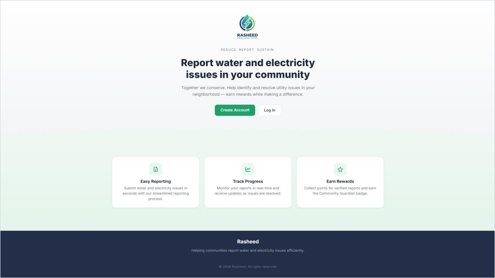
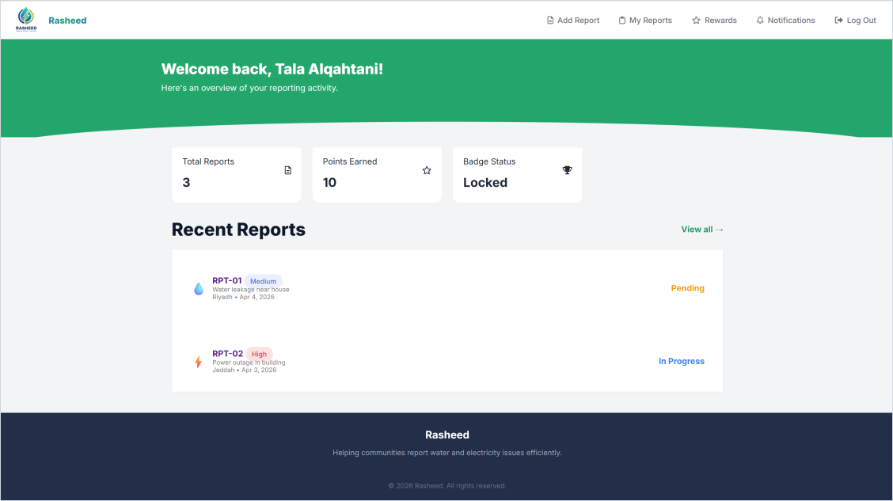
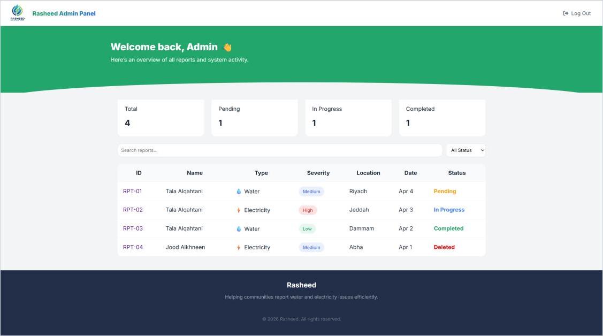
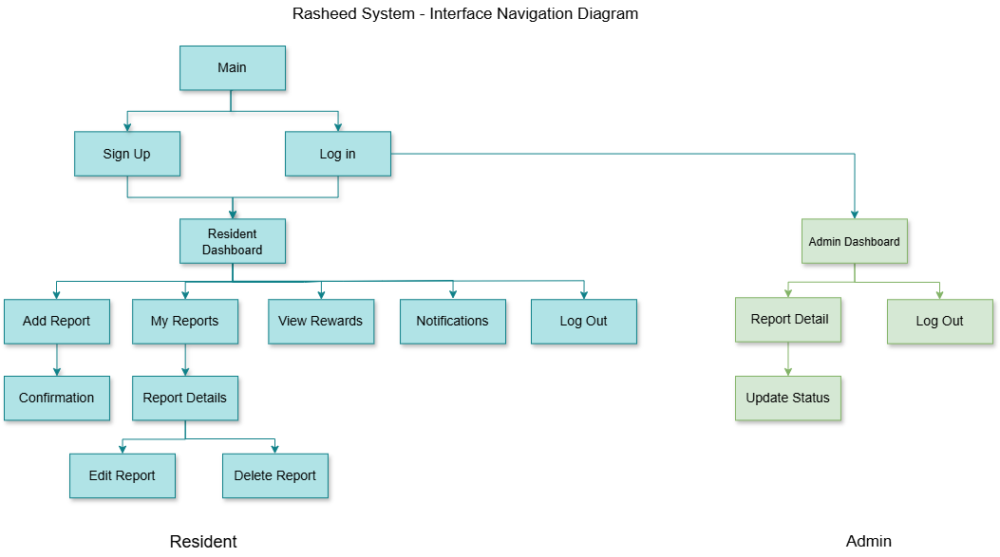

<div align="center">


# Rasheed

**A community reporting system for water and electricity issues, with report tracking, notifications and rewards.**


[Features](#features) · [Screenshots](#screenshots) · [Run it locally](#run-it-locally) · [Security](#security)

</div>

<br>



## About

Rasheed (رشيد) is a full-stack web application where residents report water and electricity problems in their neighbourhood and follow them until they are fixed. Administrators review the reports and update their status, and residents are notified at every step and earn points for issues that get resolved.

It was built as a team project for **IT320 Practical Software Engineering** at King Saud University, following a full software engineering process: requirements, design (class, component and navigation diagrams), implementation, and user acceptance testing.

## Features

**Residents**
- Register and log in (passwords are hashed; phone number and password rules are validated)
- Submit a water or electricity report with a description, location, severity and an optional photo
- See all their reports, filter them, and follow each one's status: Pending → In Progress → Completed
- Edit or delete their own reports while they are still open
- Receive a notification whenever an admin changes a report's status
- Earn **10 points** for every completed report and unlock a badge at **100 points**

**Administrators**
- Dashboard with totals for pending, in-progress and completed reports
- Search and filter all reports
- Open any report and update its status, which notifies the resident and awards points

## Screenshots

| Resident dashboard | Admin dashboard |
|---|---|
|  |  |

**How users move through the system**



## Built with

- **Front end:** HTML, CSS, JavaScript
- **Back end:** PHP (mysqli with prepared statements, sessions)
- **Database:** MySQL, managed with phpMyAdmin
- **Local server:** MAMP

## Database

MySQL database `rasheed` with four tables:

| Table | Holds |
|---|---|
| `user` | Name, phone number, hashed password and role (`admin` or `resident`) |
| `resident` | Reward points for each resident |
| `report` | Type, description, location, severity, status, photo and owner of each report |
| `notification` | Status-update messages sent to residents |

## Run it locally

1. Install [MAMP](https://www.mamp.info/) (or XAMPP) and start Apache and MySQL.
2. Copy the `src` folder into the server's web folder (`htdocs`).
3. Open phpMyAdmin, create a database named **`rasheed`**, and import `database/rasheed_project.sql`.
4. Check the database login in `src/db.php` (MAMP's default user and password are `root` / `root`).
5. Open `http://localhost:8888/src/` (or your server's address).

**Demo accounts** (fake data, for testing only):

| Role | Phone number | Password |
|---|---|---|
| Admin | `0500000001` | `Admin1234` |
| Resident | `0500000002` | `Resident123` |

## Security

The project was reviewed and hardened after the course:

- **SQL injection:** every database query uses prepared statements.
- **Access control:** admin pages check the logged-in user's role on the server, and residents can only view, edit or delete their own reports.
- **Photo uploads:** only real JPG or PNG images up to 5 MB are accepted; they are stored under random names, and the uploads folder cannot run scripts or be listed.
- **Cross-site scripting:** all user-entered text is escaped before it is displayed.
- **Sessions:** the login cookie is `HttpOnly` and `SameSite=Lax` (other sites cannot submit forms using a user's login), a new session ID is issued at login and sign-up, and the cookie is cleared at logout.
- **Login:** the same message is shown for an unknown phone number and a wrong password, so accounts cannot be discovered.

## Project structure

```
├── src/
│   ├── index.php                  Landing page
│   ├── login.php, register.php    Log in / sign up (+ process_login.php, process_register.php)
│   ├── main.php                   Resident dashboard
│   ├── AddReport.php              Submit a report
│   ├── MyReports.php              List of the resident's reports
│   ├── report-det.php             Report details, delete
│   ├── EditReport.php             Edit an open report
│   ├── Notifications.php          Status-update notifications
│   ├── Rewards.php                Points and badge
│   ├── admin.php                  Admin dashboard
│   ├── report_details_admin.php   Admin report view
│   ├── update_status.php          Admin status update
│   ├── db.php, helpers.php        Database connection and shared helpers
│   ├── session.php                Secure session start
│   ├── style.css, script.js
│   ├── images/
│   └── uploads/                   Report photos
├── database/
│   └── rasheed_project.sql        Database schema and demo accounts
├── docs/
│   ├── Rasheed_Project_Report.pdf Full project report (requirements, design, testing)
│   └── screenshots/
├── AUTHORS.md
└── README.md
```

## Team

Developed by Shatha bin Mana, Tala Alqahtani, Lama Almubarak and Jood Alkhneen. Individual roles are listed in [AUTHORS.md](AUTHORS.md).
